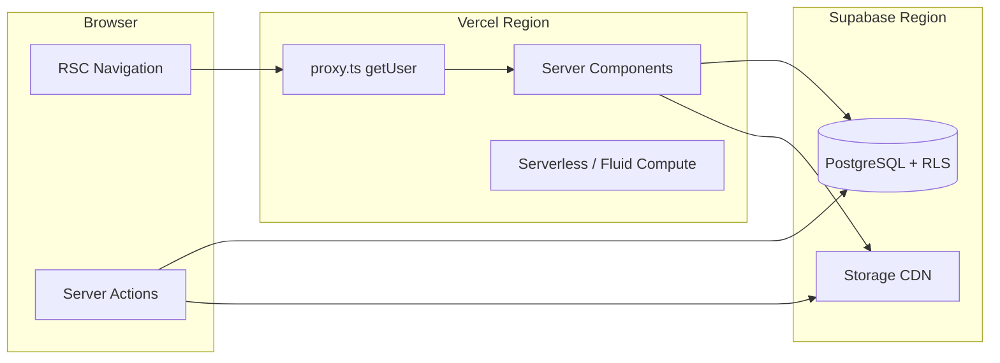
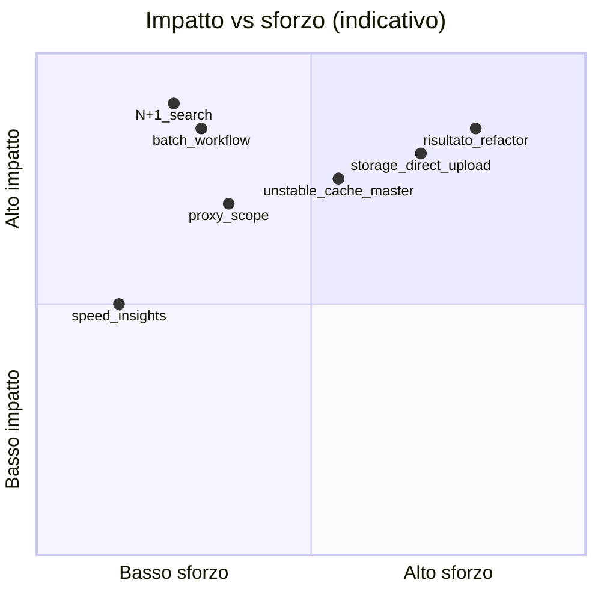
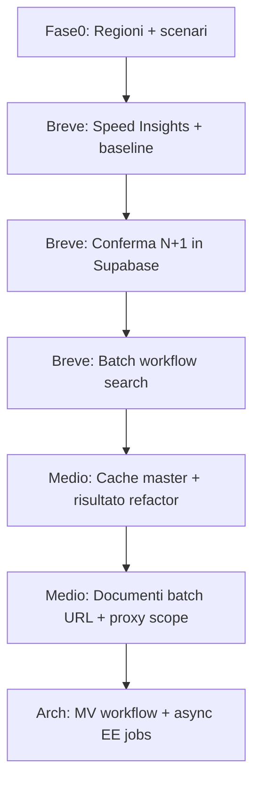
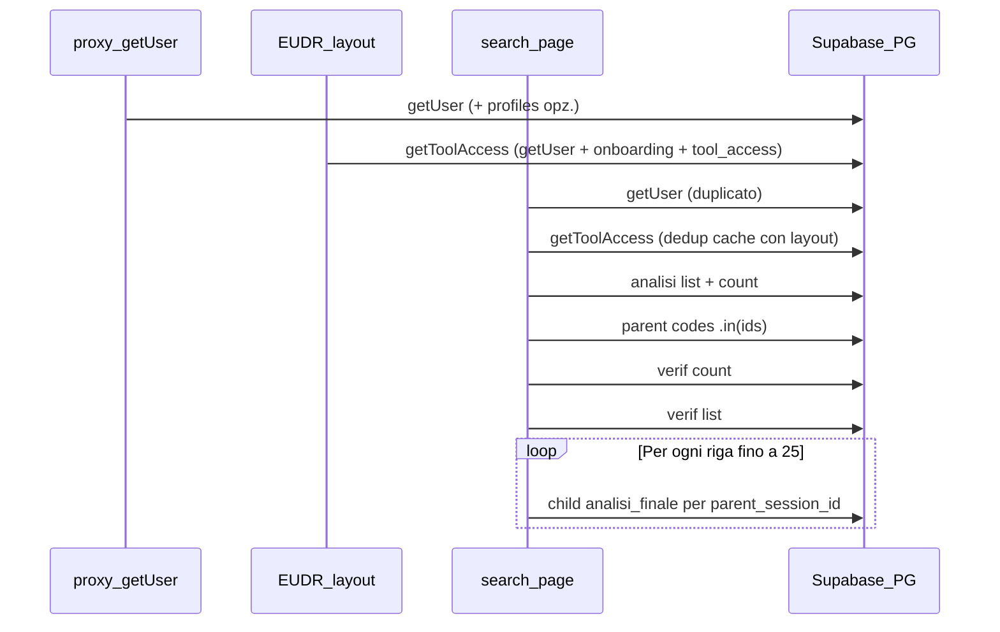

# Audit Performance — pascericonsulting (Next.js / Supabase / Vercel)

Documento tecnico per identificare, misurare e risolvere i colli di bottiglia su un'app con **documenti dinamici** (bucket `documents`, signed URL), **RLS** su PostgreSQL e **auth SSR** via proxy Supabase.

---

## Contesto applicativo (baseline dal codebase)

| Area | Stato attuale | Implicazione performance |
|------|---------------|--------------------------|
| Data fetching | Quasi tutto **RSC dinamico** + Supabase; **nessun** `unstable_cache` / `cacheTag` / `fetch` cache | Ogni navigazione = round-trip DB completi |
| Caching invalidation | Solo `revalidatePath` post-mutation ([`documents.ts`](src/actions/documents.ts), [`actions.ts`](src/actions/actions.ts)) | Nessuna cache cross-request per master data |
| Auth chain | [`src/proxy.ts`](src/proxy.ts) → `getUser()` (+ query `profiles` se loggato) su **tutte** le route matchate | Latenza fissa per navigazione |
| Hot paths | `/EUDR/search`, `/timberRegulation/search`, `/EUDR/risultato`, `/timberRegulation/risultato` | N+1 workflow, pipeline sequenziali lunghe |
| Documenti | Upload via Server Action; download = **1 signed URL per file** ([`documents.ts`](src/actions/documents.ts)) | Molti click → molte server actions |
| Osservabilità | `@vercel/speed-insights` in [`package.json`](package.json) ma **non montato** in [`layout.tsx`](src/app/layout.tsx) | Dati RUM assenti in produzione |



---

## Fase 0 — Preparazione (prima di misurare)

1. **Allineare ambienti**: audit su **Preview/Production** Vercel collegata allo stesso progetto Supabase usato in prod (non solo `npm run dev` locale).
2. **Annotare regioni**:
   - Vercel: Project Settings → Functions → Region (es. `fra1`, `iad1`).
   - Supabase: Project Settings → General → Region (es. `eu-west-1`).
   - **Obiettivo**: stessa area geografica (es. EU↔EU); ogni hop inter-continentale aggiunge ~80–150 ms RTT.
3. **Definire scenari di test ripetibili** (stesso utente/ruolo):

| Scenario | Route | Ruolo | Cosa misurare |
|----------|-------|-------|---------------|
| S1 | `/landingPage` | standard | Auth duplicata, TTFB |
| S2 | `/EUDR/search?tab=verifiche` | premium | N+1 workflow (~25 righe) |
| S3 | `/EUDR/risultato?session_id=…` | premium | Pipeline DB + PDF client |
| S4 | `/EUDR/documentation` | admin | Lista documenti + download multiplo |
| S5 | Server Action due diligence | admin | EE + storage (worst case) |

4. **Baseline numerica**: registrare 3 run per scenario (cold + warm) prima di qualsiasi fix.

---

## 1. Analisi investigativa

### 1.1 Strumenti nativi da usare

| Strato | Strumento | Cosa raccogliere | Dove |
|--------|-----------|------------------|------|
| **UX / Core Web Vitals** | [Vercel Speed Insights](https://vercel.com/docs/speed-insights) | LCP, INP, CLS, FCP, TTFB per route | Montare `<SpeedInsights />` in root layout; dashboard Vercel |
| **UX (opzionale)** | Vercel Web Analytics | Page views, bounce per route lenta | `@vercel/analytics` (non presente oggi) |
| **Server / RSC** | Vercel **Observability** (Logs, Functions) | Duration, memory, cold start, error rate | Deployment → Logs / Observability |
| **Build** | `next build` + output statico | Route `ƒ` (dynamic) vs `○` (static) | Terminale CI; nessuna route cached oggi |
| **React** | React DevTools **Profiler** | Commit time, re-render su client components (`ExportAnalysisPdfButton`, `documentsView`, form) | Dev + route interattive |
| **Rete browser** | Chrome DevTools **Network** | Waterfall RSC (`text/x-component`), dimensione payload, TTFB | Production throttling "Fast 4G" |
| **CPU browser** | Performance panel | Long tasks (PDF, maplibre, jspdf) | `/EUDR/risultato`, export PDF |
| **Database** | Supabase Dashboard → **Reports** | Query performance, API requests, Storage egress | Ultimi 7 giorni in prod |
| **Query deep-dive** | Supabase → **Database → Query Performance** (pg_stat_statements) | Query lente, mean time, calls | Filtrare tabelle hot: `assessment_sessions`, `user_responses`, `documents`, `tool_access` |
| **RLS** | `EXPLAIN (ANALYZE, BUFFERS)` su SQL Editor | Plan cost, seq scan, subquery `EXISTS` | Replicare SELECT delle pagine search/risultato |
| **Storage** | Supabase Storage metrics + Network tab | Tempo signed URL, size object | Download multipli da file explorer |
| **Auth** | Supabase Auth logs | Spike `getUser` / refresh token | Correlare con traffico proxy |

**Setup immediato consigliato** (mancante nel repo):

```tsx
// src/app/layout.tsx — da aggiungere
import { SpeedInsights } from "@vercel/speed-insights/next"
// ...
<SpeedInsights />
```

**Strumentazione server-side locale** (breve termine):

- Abilitare logging timing in dev su hot paths (es. `console.time` / OpenTelemetry se si adotta in futuro).
- `NEXT_TURBOPACK_TRACE=1` solo per debug build/HMR, non per prod.

### 1.2 Metriche specifiche — Vercel

| Metrica | Soglia indicativa | Interpretazione per questo stack |
|---------|-------------------|----------------------------------|
| **TTFB** | &lt; 800 ms (good), &gt; 1.8 s (poor) | Include proxy `getUser` + RSC data fetch sequenziale |
| **FCP / LCP** | LCP &lt; 2.5 s | Font Inter + background CSS; PDF/map pesanti su client |
| **INP** | &lt; 200 ms | Form valutazione, file explorer, tab search |
| **Function duration** (p95) | &lt; 3 s per RSC; attenzione se &gt; 10 s | `/EUDR/risultato`, due diligence |
| **Cold start rate** | Minimizzare su route frequenti | Proxy + RSC su ogni navigazione |
| **Fluid Compute** | Abilitare se disponibile | Riduce cold start su Server Actions lunghe |
| **Edge vs Node** | Verificare runtime di `proxy.ts` | Auth Supabase SSR è compatibile; misurare latenza proxy |

**Come leggere**: in Vercel Observability, filtrare per path (`/EUDR/search`, `/EUDR/risultato`) e correlare picchi TTFB con log Supabase nello stesso timestamp.

### 1.3 Metriche specifiche — Supabase

| Metrica | Dove | Cosa indica |
|---------|------|-------------|
| **API request rate / latency** | Dashboard → API | Carico globale; spike su search |
| **Postgres connections** | Database → Reports | Pool exhaustion sotto carico |
| **Cache hit ratio** (shared buffers) | Query performance / advisors | Basso hit → query ripetute non cached a livello PG |
| **Mean / p95 query time** | Query Performance | Identificare N+1 (`assessment_sessions` per `parent_session_id`) |
| **Seq scans** su tabelle grandi | `EXPLAIN` + advisors | Indici mancanti o RLS che impedisce index usage |
| **RLS overhead** | Confronto query come `service_role` vs `authenticated` | Subquery `EXISTS (tool_access …)` — già supportate da `idx_tool_access_user_tool` ([migration iniziale](supabase/migrations/20260322141411_schema_iniziale.sql)) |
| **Storage egress / bandwidth** | Storage metrics | Download ripetuti documenti / tile EE |
| **Realtime (se usato)** | — | Non critico oggi |
| **Auth MAU / token refresh** | Auth | Correlato a proxy su ogni navigazione |

**Nota**: Supabase non espone un "RLS execution time" separato; si misura indirettamente con `EXPLAIN (ANALYZE)` e confrontando plan con/senza RLS (`SET ROLE authenticated`).

**Query da profilare per prime** (derivate dal codice):

```sql
-- Pattern N+1 search (ripetuto fino a 25 volte)
SELECT id, status, created_at FROM assessment_sessions
WHERE tool_id = $1 AND session_type = 'analisi_finale' AND parent_session_id = $2;

-- Lista documenti
SELECT * FROM documents WHERE tool_id = $1 AND parent_id = $2 ORDER BY ...;
-- Index: idx_documents_tool_parent
```

### 1.4 Metriche — Application layer (checklist misurazione)

Per ogni scenario S1–S5, registrare:

- Numero query Supabase per request RSC (target: &lt; 5 su search dopo fix)
- Tempo totale server (header `Server-Timing` se aggiunto)
- Dimensione payload RSC
- Numero Server Actions per azione utente (download N file = N actions oggi)

---

## 2. Check-list dei sospetti comuni

### 2.1 Data fetching (Next.js App Router)

| # | Sospetto | Evidenza nel progetto | Come verificare |
|---|----------|----------------------|-----------------|
| D1 | **Waterfall sequenziale** su search | Analisi → count → list → N workflow | Network: una fetch RSC lunga; log query count |
| D2 | **N+1 query** | [`resolveEudrWorkflowState`](src/lib/eudr-workflow-state.ts) chiamato per riga in [`EUDR/search/page.tsx`](src/app/EUDR/search/page.tsx) | pg_stat: stessa query con 25 `parent_session_id` diversi |
| D3 | **Auth triplicata** | `getUser` + `getToolAccess` (layout+page) + proxy | Contare chiamate Auth per navigazione |
| D4 | **Nessuna cache dati semi-statici** | sections/questions/species/country | Query identiche su ogni load valutazione |
| D5 | **Write-on-read** | `risultato` aggiorna session su GET | Log UPDATE durante page view |
| D6 | **Client bundle pesante** | jspdf, maplibre, `@google/earthengine` | Bundle analyzer; Performance long tasks |
| D7 | **Server Actions senza batch** | `getDownloadUrl` per file; bulk invite sequenziale | Network: burst POST |
| D8 | **Proxy su tutte le route** | Matcher ampio in [`proxy.ts`](src/proxy.ts) | Confrontare TTFB route pubblica vs protetta |

### 2.2 PostgreSQL / RLS

| # | Sospetto | Evidenza | Come verificare |
|---|----------|----------|-----------------|
| P1 | **RLS `EXISTS (tool_access)`** su ogni SELECT | policies su `documents`, sessions | EXPLAIN: nested loop su `tool_access` |
| P2 | **SELECT ampie** | `questions (*)` nested in risk-analysis | Row size / JSON aggregation |
| P3 | **Chunk `.in()` grandi** | [`questions.ts`](src/actions/questions.ts) batch 500 | OK se indicizzato; verificare plan |
| P4 | **RPC ricorsiva** | `get_recursive_storage_paths` delete folder | EXPLAIN CTE su `documents.parent_id` |
| P5 | **Indici** | `idx_documents_tool_parent`, `idx_tool_access_*` presenti | Advisors "unindexed foreign keys" |
| P6 | **Storage RLS troppo larga** | `Read documents`: bucket intero per autenticati | Policy review + test accesso path altrui |

### 2.3 Regione / rete / Storage CDN

| # | Sospetto | Come verificare |
|---|----------|-----------------|
| R1 | **Vercel ≠ Supabase region** | Settings; traceroute / TTFB da EU client |
| R2 | **Signed URL short TTL (60s)** | Re-download frequente; no CDN cache browser |
| R3 | **Upload via Server Action** | File attraversano Vercel function (doppio hop) |
| R4 | **Nessun `next/image` remotePatterns** | Irrilevante se solo signed URL; verificare uso Image |
| R5 | **Earth Engine esterno** | Latenza azione due diligence indipendente da regione DB |

### 2.4 Priorità per impatto stimato



---

## 3. Soluzioni architetturali per criticità

### Mappa criticità → best practice

| ID | Criticità | Best practice (stack Next/Supabase) |
|----|-----------|--------------------------------------|
| D2 | N+1 workflow search | **Batch loader**: `getWorkflowStatesForParents(supabase, parentIds[])` — una query `.in('parent_session_id', ids)` + `deriveEudrWorkflowStateFromSnapshot` in memoria (funzione pura già esistente) |
| D1 | Waterfall search | `Promise.all` per query indipendenti; **lazy load tab** — caricare lista verifiche solo se `tab=verifiche` |
| D3 | Auth ripetuta | Unificare su [`createClient`](src/utils/supabase/server.ts); pagina usa solo `getToolAccess` (già `cache()`); rimuovere `getUser` ridondante; landing: non chiamare `isOnboardingComplete` se già in `getToolAccess` |
| D4 | Master data ripetuta | `unstable_cache` / Cache Components (`use cache` + `cacheTag`) per `sections`+`questions` per `tool_id` con invalidation su mutation master |
| D5 | Write-on-read risultato | Spostare completamento sessione in **Server Action esplicita** (`finalizeSession`) invocata al submit, non nel render GET |
| D7 | Download N file | `getDownloadUrls(documentIds[])` batch signed URLs; oppure TTL 5–15 min con path validation |
| P1 | RLS costosa | Mantenere `SECURITY DEFINER` helper `is_admin_of_tool`; assicurare **STABLE** e indici compositi; evitare join doppi su `profiles` in hot path |
| P6 | Storage read largo | Policy storage: `split_part(name,'/',1) = tool_id` + `EXISTS` su `tool_access` (allineare a upload/delete) |
| R1 | Latenza regione | Allineare Vercel Function region a Supabase; documentare in README deploy |
| R3 | Upload via server | **Direct upload** Supabase Storage da client con policy RLS + metadata insert via Server Action leggera |
| R2 | CDN storage | Signed URL con TTL più lungo per download; per asset pubblici master usare transform CDN (non applicabile a doc privati) |

---

## 4. Piano d'intervento per fasi

### Breve termine (1–3 giorni) — misurare e quick wins

**Obiettivo**: baseline + fix a basso rischio.

1. Montare **Speed Insights** (+ opzionale Web Analytics) in [`layout.tsx`](src/app/layout.tsx).
2. Eseguire scenari S1–S5 in produzione; esportare screenshot Vercel + Supabase Query Performance.
3. Verificare **allineamento regioni** Vercel/Supabase; correggere se mismatch.
4. Abilitare **Vercel Observability** e Fluid Compute sul progetto.
5. Profilare in Supabase le **top 10 query** per mean time — confermare N+1 su `assessment_sessions`.
6. **Quick win codice** (se si passa all'implementazione):
   - Batch `resolveEudrWorkflowState` / timber equivalente su search pages.
   - `Promise.all` dove le query sono indipendenti (search).
   - Rimuovere `getUser` duplicato dove esiste già `getToolAccess`.
7. Rimuovere eventuali chiamate debug (`127.0.0.1:7443/ingest`) se presenti in prod ([`UserService`](src/actions/UserService.ts)).
8. Documentare in un foglio conmotionale: query count per route **prima/dopo**.

### Medio termine (1–3 settimane) — ottimizzazione strutturata

**Obiettivo**: ridurre TTFB e carico DB del 40–60% sulle route hot.

1. **Refactor `/EUDR/risultato` e `/timberRegulation/risultato`**:
   - Spezzare data loader in funzione condivisa.
   - Parallelizzare parent/child responses, supplier, lookup labels.
   - Eliminare side-effect su GET.
2. **Caching master data**: `unstable_cache` per sections/questions/country/species per `tool_id`; `revalidateTag` da actions master.
3. **Proxy matcher**: restringere auth refresh a route che richiedono sessione (escludere asset, eventuali route statiche).
4. **Documenti**:
   - Server Action batch per signed URLs.
   - Valutare upload diretto client → Storage.
   - Hardening `getDownloadUrl` con check `tool_id` + row ownership.
5. **PostgreSQL**:
   - `EXPLAIN ANALYZE` su query search/risultato con utente reale.
   - Advisors Supabase: indici mancanti, RLS initplan.
6. **Client performance**:
   - `dynamic(() => import(...))` per PDF export e mappe.
   - React Profiler su form valutazione — memo su liste lunghe.
7. **CI guardrail**: script che fallisce build se query count in test integration supera soglia (opzionale).

### Architetturale (1–2 mesi) — resilienza e scalabilità

**Obiettivo**: architettura misurabile, costi prevedibili, latenza stabile sotto carico.

1. **Data layer dedicato**:
   - View/materialized view per stato workflow (denormalizzare `child_count`, `latest_child_id` su `assessment_sessions` via trigger).
   - Aggiornamento async su eventi (status change) invece di calcolo per riga in search.
2. **Caching strategy esplicita**:
   - Documentare per route: `dynamic` | `revalidate: N` | `cached` master.
   - Cache Components Next 16 dove i dati sono tool-scoped e invalidabili.
3. **Storage architecture**:
   - Upload diretto + webhook/Action per metadata.
   - Lifecycle policy bucket (archivio, tier) se volumi crescono.
4. **Due diligence / Earth Engine**:
   - Spostare job lunghi su **queue** (Supabase Edge Function + `pg_cron`, o Vercel Workflow) con polling UI — evitare Server Action sincrona &gt; 60s.
5. **Osservabilità end-to-end**:
   - Trace ID da RSC → Supabase (header custom) per correlare log Vercel/Supabase.
   - Dashboard interna: p95 per route + query count.
6. **Security ↔ performance**:
   - Restringere storage RLS read per tool.
   - Audit `SECURITY DEFINER` functions usate in RLS.
7. **Load testing**:
   - k6 o Artillery su `/EUDR/search` con 20 utenti concorrenti; monitorare connection pool Supabase.

---

## 5. Criteri di successo (Definition of Done)

| KPI | Baseline (da misurare) | Target post medio termine |
|-----|------------------------|---------------------------|
| TTFB `/EUDR/search` | _TBD_ | −40% |
| Query DB per search verifiche | ~25–30 | ≤ 6 |
| TTFB `/EUDR/risultato` | _TBD_ | −30% |
| LCP (Speed Insights) | _TBD_ | "Good" su route principali |
| p95 function duration | _TBD_ | &lt; 5 s (escluso due diligence async) |
| Download 10 file | 10 server round-trips | 1 batch action |

---

## 6. Ordine di esecuzione consigliato (sintesi)



---

## File chiave da monitorare durante l'audit

- Proxy/auth: [`src/proxy.ts`](src/proxy.ts), [`src/utils/supabase/proxy.ts`](src/utils/supabase/proxy.ts), [`src/lib/tool-auth.ts`](src/lib/tool-auth.ts)
- N+1: [`src/lib/eudr-workflow-state.ts`](src/lib/eudr-workflow-state.ts), [`src/app/EUDR/search/page.tsx`](src/app/EUDR/search/page.tsx)
- Pagine pesanti: [`src/app/EUDR/risultato/page.tsx`](src/app/EUDR/risultato/page.tsx)
- Documenti: [`src/actions/documents.ts`](src/actions/documents.ts), [`src/components/ui/fileExplorer.tsx`](src/components/ui/fileExplorer.tsx)
- Schema/RLS: [`supabase/migrations/20260322141411_schema_iniziale.sql`](supabase/migrations/20260322141411_schema_iniziale.sql)

---

## 7. Fase prioritaria — `/EUDR/search` (evidenze profiling + piano step-by-step)

**Baseline confermata in produzione (Chrome Performance, trace `Trace-20260519T155521.json`):**

| Collo | Misura | Interpretazione |
|-------|--------|-----------------|
| Server (RSC) | ~700 ms sulla richiesta principale `/EUDR/search` | Coerente con waterfall + fino a **~30 query Supabase** per pagina |
| Client Long Task | 391 ms "Valutazione script" | **Analisi trace:** il task da 391 ms è **interamente** script di estensione Chrome (`chrome-extension://elfaihghhjjoknimpccccmkioofjjfkf/...`), non bundle app. Il costo app misurabile nel trace è ~**204 ms** su script inline (hydration/parsing RSC payload) |
| Azione profiling | Ripetere in **finestra Incognito** (estensioni disabilitate) prima di ottimizzare il client | Evita falsi positivi su D6 |

**Ordine di lavoro:** Fase 0 (Vercel) → Fase 1 (solo server) → misurare → Fase 2 (client) → Fase 3 (Timber search) → altre route una per una.

---

### 7.0 Prerequisiti — osservabilità Vercel (prima di qualsiasi fix)

Senza questi step non si può correlare fix ↔ metriche in dashboard.

| Step | File / azione | Scopo |
|------|---------------|--------|
| 1 | Aggiungere `<SpeedInsights />` in [`src/app/layout.tsx`](src/app/layout.tsx) (`@vercel/speed-insights` già in package.json) | TTFB, FCP, LCP, INP per route in produzione |
| 2 | (Opzionale) `@vercel/analytics` + `<Analytics />` | Traffico per route, confronto prima/dopo |
| 3 | Vercel Dashboard → Project → **Observability** (o Logs) | p50/p95 **Function Duration** filtrato su `/EUDR/search` |
| 4 | Abilitare **Fluid Compute** (se non attivo) | Riduce cold start su RSC + Server Actions |
| 5 | Verificare **Function Region** = regione Supabase (es. entrambi EU) | Riduce RTT su ogni query |
| 6 | Aggiungere header diagnostico temporaneo in search page (solo preview/staging): `Server-Timing: auth;dur=X, db;dur=Y, queries;desc="N"` | Correlare con Network tab finché non c’è APM dedicato |
| 7 | Supabase Dashboard → Query Performance durante test | Confermare ripetizione query `parent_session_id = $1` |
| 8 | Registrare baseline **prima** del refactor: TTFB, query count, p95 Vercel, top query Supabase | Definition of done per Fase 1 |

**Nota deploy:** il trace punta a URL preview Vercel (`pascericonsulting-ero75jlvz-...`). Per Speed Insights usare deploy production o preview con env collegato; confrontare sempre stesso ambiente.

---

### 7.1 Punto 1 — Server Data Fetching (analisi, niente implementazione ancora)

#### Dove guardare (file)

| File | Ruolo |
|------|--------|
| [`src/app/EUDR/search/page.tsx`](src/app/EUDR/search/page.tsx) | Orchestrazione query + N+1 |
| [`src/lib/eudr-workflow-state.ts`](src/lib/eudr-workflow-state.ts) | Query per riga (`resolveEudrWorkflowState`) |
| [`src/app/EUDR/layout.tsx`](src/app/EUDR/layout.tsx) | `getToolAccess` su ogni navigazione |
| [`src/lib/tool-auth.ts`](src/lib/tool-auth.ts) | `getUser` + onboarding + `tool_access` |

#### Waterfall attuale (sequenziale)



#### Inventario query (stima per load completo, tab qualsiasi)

| # | Query | Righe codice | Note |
|---|--------|--------------|------|
| 1 | `auth.getUser()` | page L52-54 | Ridondante con `getToolAccess` |
| 2 | `getToolAccess` | L57, layout L19 | Dedup `cache()` tra layout e page |
| 3 | Analisi paginate + count | L76-110 | Sempre eseguita |
| 4 | Parent `evaluation_code` batch | L128-132 | OK (batch `.in`) |
| 5 | Verifiche count | L161-167 | Sempre eseguita anche su tab `analisi` |
| 6 | Verifiche list | L171-196 | Sempre eseguita |
| 7–31 | `resolveEudrWorkflowState` × N | L202-226 + workflow L65-71 | **N+1**: stessa SELECT con `parent_session_id` diverso |

**Query N+1 esatta** (ripetuta fino a 25 volte):

```sql
SELECT id, status, created_at FROM assessment_sessions
WHERE tool_id = $eudr AND session_type = 'analisi_finale'
  AND parent_session_id = $verifica_id
ORDER BY created_at DESC;
```

Codice sorgente del loop:

```202:226:src/app/EUDR/search/page.tsx
  const verificationRows: EudrVerificationRow[] = await Promise.all((verifData || []).map(
    async (row) => {
      const workflowState = await resolveEudrWorkflowState(
        supabase,
        { id: row.id, status: row.status, final_outcome: row.final_outcome, metadata: row.metadata },
        row.status === "completed" && row.final_outcome !== "Esente / Non Soggetto"
      )
      // ...
    }
  ))
```

`Promise.all` **parallelizza** ma non **batcha**: restano N round-trip HTTP → PostgreSQL (tipico contributo ai ~700 ms).

#### Problema secondario: fetch tab-agnostico

Il parametro `tab` (L28) controlla solo la UI client, ma il server **carica sempre** analisi + verifiche + workflow. Su tab `analisi` si pagano comunque query 5–31.

---

### 7.2 Refactoring server proposto (Fase 1 — da implementare nel prossimo step)

**Obiettivo:** portare query DB da ~30 a **≤ 6** e TTFB −40%+.

#### Step 1.1 — Batch loader workflow (priorità massima)

Creare in [`src/lib/eudr-workflow-state.ts`](src/lib/eudr-workflow-state.ts) (o file adiacente `eudr-workflow-batch.ts`):

```ts
// Pseudocodice — non implementare tutto insieme al primo commit
export async function resolveEudrWorkflowStatesBatch(
  supabase,
  rootSessions: Array<{ id; status; final_outcome; metadata; fallbackStep1Completed? }>
): Promise<Map<string, EudrWorkflowState>> {
  const parentIds = rootSessions.map(s => s.id)
  if (parentIds.length === 0) return new Map()

  const { data: childRows } = await supabase
    .from("assessment_sessions")
    .select("id, status, created_at, parent_session_id")
    .eq("tool_id", EUDR_TOOL_ID)
    .eq("session_type", "analisi_finale")
    .in("parent_session_id", parentIds)
    .order("created_at", { ascending: false })

  // Raggruppa childRows per parent_session_id in memoria
  // Per ogni rootSession: deriveEudrWorkflowStateFromSnapshot(...)
}
```

Poi in `page.tsx` sostituire il `Promise.all(map(resolveEudrWorkflowState))` con una chiamata batch + map in memoria.

**Indice:** esiste già copertura su `parent_session_id` nelle migration iniziali; verificare con `EXPLAIN` che Postgres usi index su `(tool_id, session_type, parent_session_id)`.

#### Step 1.2 — Lazy load per tab

| `tab` | Query da eseguire |
|-------|------------------|
| `analisi` (default) | auth + analisi (+ parent codes). **Skip** verif count/list/workflow |
| `verifiche` | auth + verif count + verif list + **batch workflow** |

Implementazione: branch early in `page.tsx` dopo auth, in base a `params.tab`.

#### Step 1.3 — `Promise.all` per fasi indipendenti

Quando servono **entrambi** i dataset (es. prefetch o future API):

```ts
const [analisiResult, verifCountResult] = await Promise.all([
  analisiQuery...,
  verifCountQuery...,
])
// Poi verif list solo se tab === 'verifiche'
```

#### Step 1.4 — Dedup auth

- Rimuovere `getUser()` standalone in page (L52-55).
- Usare solo `getToolAccess(EUDR_TOOL_ID)` che già chiama `getUser()` internamente.
- Opzionale: esporre `user.id` da `getToolAccess` per evitare secondo client Supabase.

**Non toccare ancora:** proxy matcher, caching `unstable_cache`, materialized views (Fase 3+ / architetturale).

#### Verifica post-fix

- Chrome Network: TTFB documento `/EUDR/search` &lt; ~450 ms (target indicativo).
- Header `Server-Timing` / log: `queries=5` o meno su tab analisi.
- Supabase Query Performance: scompare picco di 25 query identiche.

---

### 7.3 Punto 2 — Client bundle (Fase 2, dopo Fase 1 e re-baseline Vercel)

#### Albero componenti client della route

```
EUDR/layout (Server)
  └── ToolNavbar ('use client') — lucide: ~12 icone
search/page (Server)
  └── EudrSearchView ('use client')
        ├── EudrAnalisiTable ('use client') — tab analisi
        │     └── DataManagementTable + EditableSessionName + deleteRecords (SA)
        └── DataManagementTable — tab verifiche (stesso modulo)
```

| Modulo | Peso stimato | Note |
|--------|--------------|------|
| [`EudrSearchView.tsx`](src/components/EudrSearchView.tsx) | Medio | Importa **entrambe** le tabelle; bundle include codice tab inattivo |
| [`DataManagementTable.tsx`](src/components/admin/DataManagementTable.tsx) | Medio-alto | Sort/filter UI, radix Checkbox/Input, sonner toast |
| [`EudrAnalisiTable.tsx`](src/components/EudrAnalisiTable.tsx) | Medio | `EditableSessionName`, icone lucide |
| [`topBar.tsx`](src/components/ui/topBar.tsx) | Medio | `ICON_MAP` con molte icone lucide (tree-shaking parziale) |
| `deleteRecords` | Basso sul client | Server Action — **non** dovrebbe trascinare `@google/earthengine` nel bundle client |

**Non presenti su questa route:** jspdf, maplibre, Earth Engine (sospetto D6 **non applicabile** direttamente a `/EUDR/search`; da confermare con bundle analyzer).

#### Interventi client (dopo misura pulita)

1. **Profiling corretto:** Incognito + Performance; oppure `@next/bundle-analyzer` su `npm run build`.
2. **Code-splitting tab:**
   - `const EudrAnalisiTable = dynamic(() => import('...'), { ssr: false })` solo se non serve SSR tabella (valutare: dati sono già SSR, tabella può restare client con dynamic import).
   - Stesso per blocco verifiche / `DataManagementTable`.
3. **Separare layout navbar:** `dynamic(() => import('@/components/ui/topBar'))` se il chunk icone pesa.
4. **Non spostare logica tabella su Server Component** per interattività (sort, bulk delete, `useSearchParams`); i dati restano RSC, la UI interattiva resta client leggera.

---

### 7.4 Roadmap pagine successive (dopo EUDR search)

| Ordine | Route | Problema atteso | Riutilizzo |
|--------|-------|-----------------|------------|
| 3 | `/timberRegulation/search` | Stesso N+1 su `resolveTimberWorkflowState` | Stesso batch loader pattern |
| 4 | `/EUDR/risultato` | Pipeline sequenziale lunga, write-on-read | Loader dedicato |
| 5 | `/EUDR/risk-analysis`, `/evaluation` | sections+questions nested | `unstable_cache` master |
| 6 | `/EUDR/documentation` | Signed URL N+1 | Batch URLs |

Ogni pagina: baseline Vercel → fix → misura → passo alla successiva.
